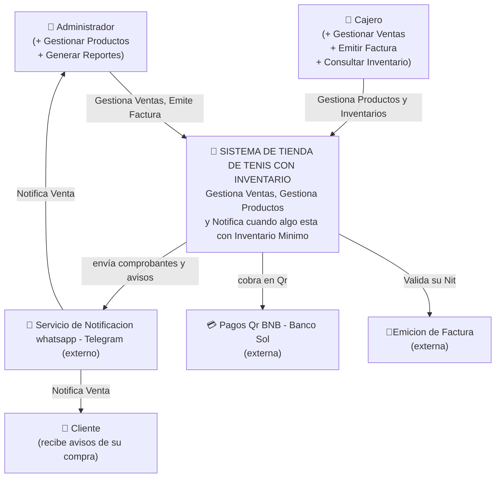

# C4 COMERCIO — "Tienda de Tenis con inventario"
---
## Nivel 1 — Contexto (el sistema y su mundo)

La pregunta que responde: **¿quién usa el sistema y con qué otros sistemas habla?**
Una caja para TU sistema; personas y sistemas externos alrededor. Nada de detalles internos.

---

## Nivel 2 — Contenedores (el zoom adentro del sistema)

