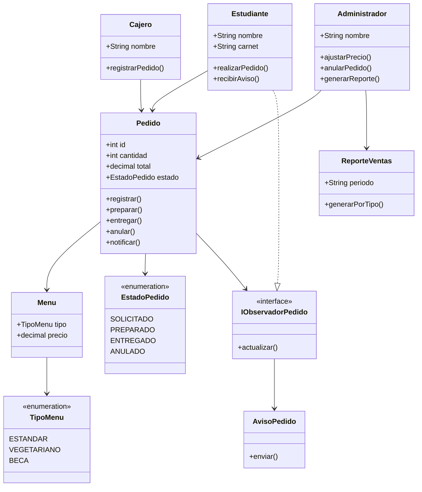

# Diagrama de clases — Comedor Universitario "Sabor Andino"
---
## Estudiante: Ariel Alvarez Mamani

## Parte 1 — El plano (6 puntos)

diagrama.md (Mermaid) o imagen legible: el diagrama de clases del sistema a partir de los requerimientos (receta
de 4 pasos: sustantivos, verbos, filtro, relaciones). Con tu nombre completo visible dentro del diagrama.

---