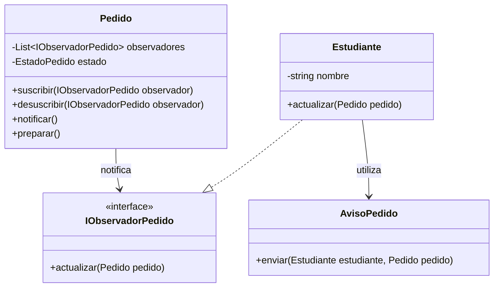

## Parte 3 — El patrón (6 puntos)
---
Uno de los requerimientos del comedor pide A GRITOS un patrón del curso. En patron.md : cuál es el requerimiento, qué patrón aplicás, el diseño (diagrama o código corto con los nombres del comedor) y la justificación: por qué ESE y qué pasa sin él.
---
## Requerimiento que lo solicita el Comedor Universitario "Sabor Andino"

El comedor establece que cuando un pedido queda preparado, el estudiante debe recibir un aviso. Este requerimiento implica que un cambio de estado de un `Pedido` debe provocar una notificación al estudiante sin que la clase `Pedido` tenga que conocer directamente todos los mecanismos concretos de comunicación.

## PATRON APLICADO : OBSERBER - Comedor Universitario "Sabor Andino"

**Observer (Observador).**

El `Pedido` actúa como sujeto observable y el `Estudiante` como observador.

Cuando el pedido cambia al estado `PREPARADO`, el pedido notifica a los observadores registrados.

### Diseño - Comedor Universitario "Sabor Andino"

## justificación - ¿Por qué Observer?

Observer es necesario existe una relación de **uno a muchos** entre un objeto que cambia de estado y los objetos que necesitan conocer ese cambio.Además, permite que `Pedido` no dependa directamente de una implementación concreta de notificación.

## justificación - ¿Qué ocurre sin Observer?

Sin Observer, `Pedido` tendría que llamar directamente a los mecanismos de aviso. Esto aumentaría el acoplamiento y obligaría a modificar `Pedido` cada vez que aparezca un nuevo mecanismo de notificación. Con Observer, `Pedido` solamente conoce la abstracción y delega en los observadores concretos la reacción al cambio.
